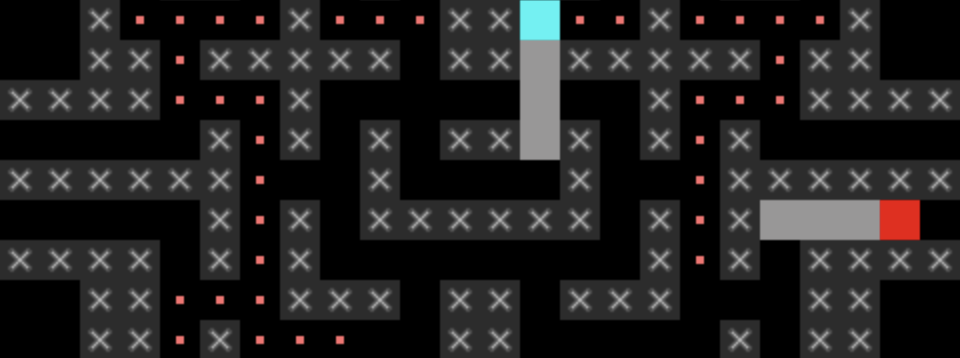

# *Sibilant Snakelikes*

# [Play Online](http://www.pippinbarr.com/sibilant-snakelikes/) (desktop and mobile)

## Description
*Sssnakes can do anything! Sssubdue colossssssi! Ssstamp passssssportsss! Sssweep minesss! Ssscore goalsss! Ssstop missssssiles! Circumvent ghossstsss! Ssswwoop through World 1-1! Go sssnakesss!*

*Sibilant Snakelikes* is a set of variations on the classic mobile phone game *Snake*. Each variation adapts a well-known game into the visual and gameplay language of *Snake*. Enjoy snake-y versions of *Shadow of the Colossus*, *Minesweeper*, and more.

## Documentation
* Read the [Process Documentation](../process) for todos and design explorations
* Read the [Commit History](https://github.com/pippinbarr/sibilant-snakelikes/commits/master) for detailed, moment-to-moment insights into the development process
* Look at the [Code Repository](https://github.com/pippinbarr/sibilant-snakelikes) for source code etc.

## Press
* Kottke, Jason. [Sibilant Snakelikes](https://kottke.org/17/12/sibilant-snakelikes). kottke.org. 13 December 2017.
* Pierrec. [Sibilant Snakelikes](http://oujevipo.fr/general/6463-sibilant-snakelikes/). L'Oujevipo. 14 December 2017.
* Johnson, Jason. [What if Every Game Was ‘Snake’ on an Old Nokia?](https://motherboard.vice.com/en_us/article/5955zb/what-if-every-game-was-snake-on-an-old-nokia). Motherboard. 18 December 2017.

Read the [Press Kit](../press) for press information

## License
*Sibilant Snakelikes* is licensed under a [Creative Commons Attribution-NonCommercial 3.0 Unported License](http://creativecommons.org/licenses/by-nc/3.0/).
