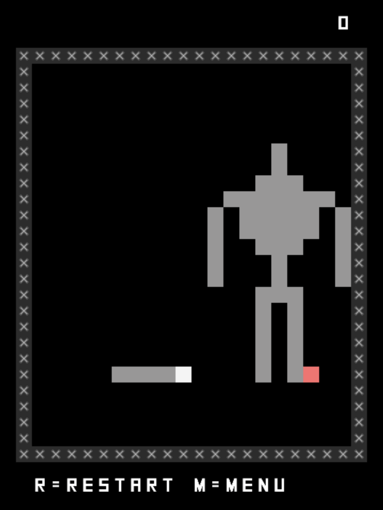
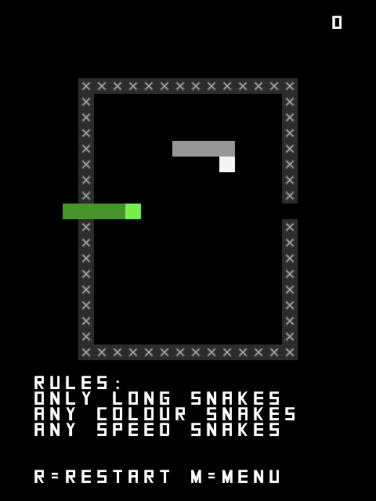
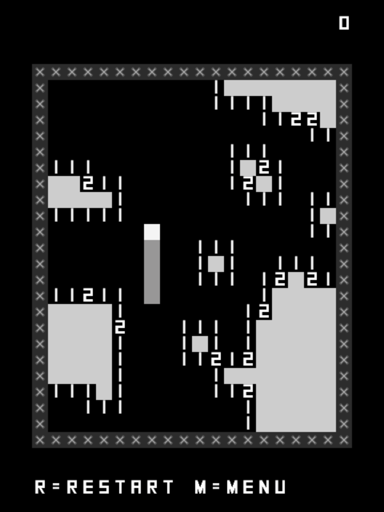
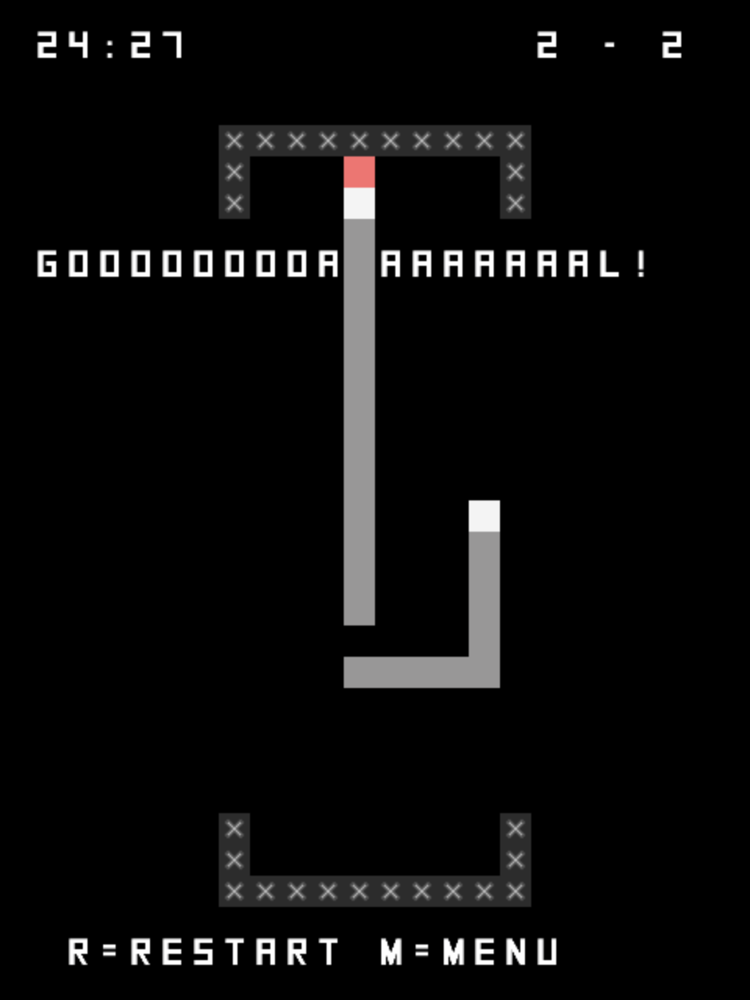
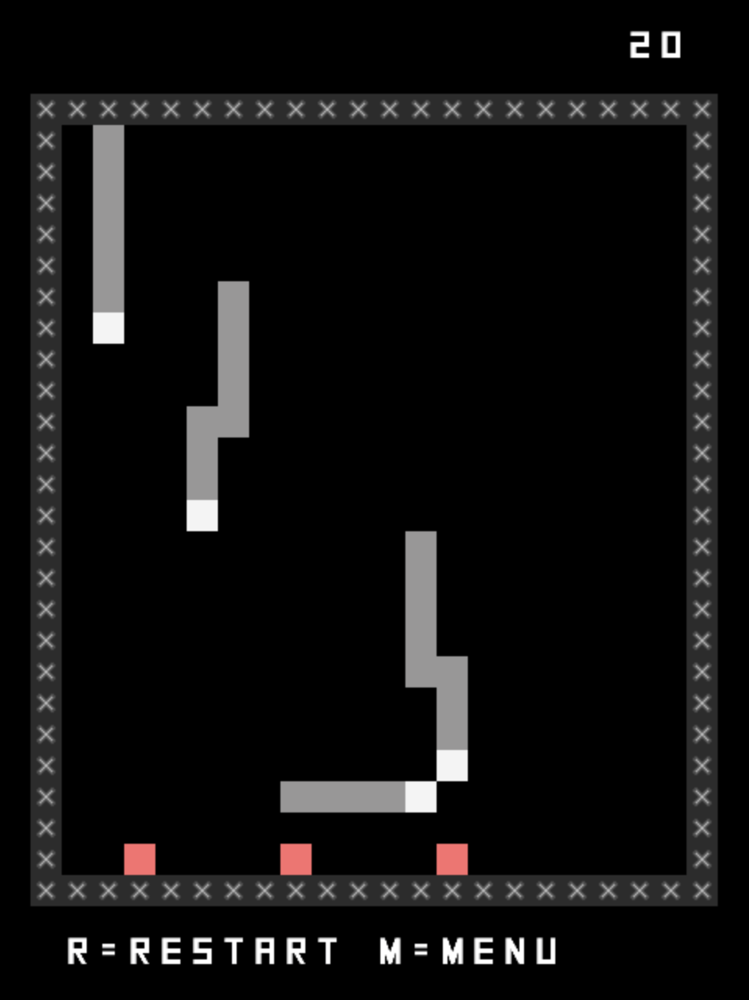
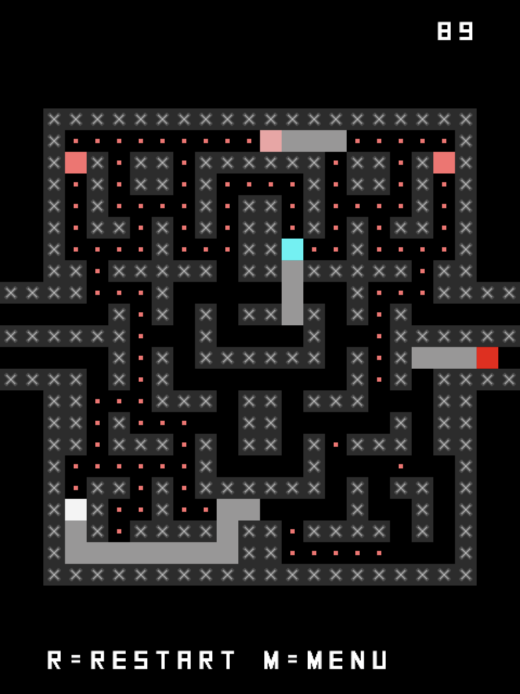
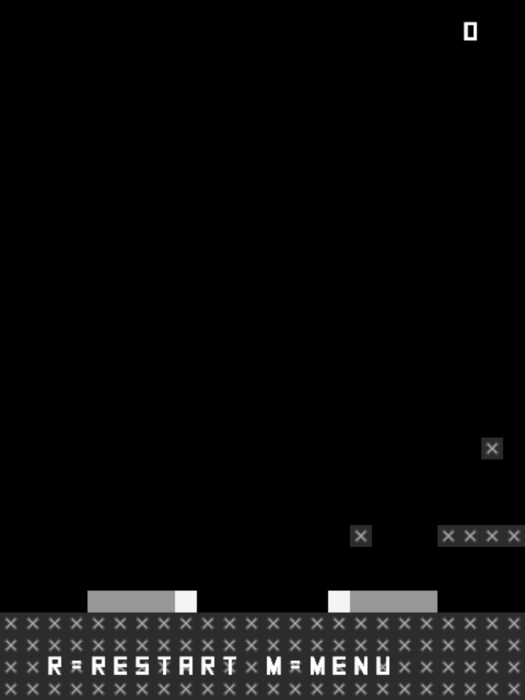

# *Sibilant Snakelikes* Press Kit

#### [Play _Sibilant Snakelikes_](https://pippinbarr.github.io/sibilant-snakelikes/)

## The basics

* Developer: [Pippin Barr](http://www.pippinbarr.com/)
* Release: 13th December, 2017
* Platform: Browser (mobile- and tablet-friendly)
* Code repository: https://www.github.com/pippinbarr/sibilant-snakelikes/
* Price: $0.00

## Who is this Pippin Barr guy?

Pippin is an Assistant Professor in the [Department of Design and Computation Arts](http://www.concordia.ca/finearts/design.html) at [Concordia University](http://www.concordia.ca/) in Montréal.

He is the associate director of the [Technoculture, Art, and Games (TAG)](http://tag.hexagram.ca/) research centre, which is part of the [Milieux Institute for Arts, Culture, and Technology](http://milieux.concordia.ca/).

## Description

Sssnakes can do anything! Sssubdue colossssssi! Ssstamp passssssportsss! Sssweep minesss! Ssscore goalsss! Ssstop missssssiles! Circumvent ghossstsss! Ssswwoop through World 1-1! Go sssnakesss!

## History

_Sibilant Snakelikes_ is a spiritual sequel to [_Indie Bungle 2: Breakout Indies_](http://www.pippinbarr.com/2016/01/20/indie-bungle-2-breakout-indies/) and [_SNAKISMS_](http://www.pippinbarr.com/2017/01/25/snakisms/). It is a sequence of seven games that translate pre-existing, generally well-known games into the visual language and the mechanics of Snake. The early idea for the game came while talking to Rilla about Snake-translations of games as a way to make a new Indie Bungle. Over time the Indie Bungle label has fallen away as it felt too ungainly (and unimportant to the spirit of the game).

Making the game has been a continuation of my interest in thinking about how the language of videogames works to express ideas. It strikes me that one useful experimental approach to understanding this is to "translate" one game's expression into the language of another game. In trying to work out how the very simple mechanics and concepts of Snake can convey different sets of ideas (fighting a colossus, eating dots and running away from ghosts, playing soccer) I was forced to grapple fairly deeply with making reasoned design choices. The translation process doesn't necessarily lead to "good games" and certainly not to games that are evocative in the same way as the originals, but I do think it shows us something about how a game like Snake can communicate more complex ideas without really changing it very much mechanically (there are exceptions to this of course). And then on the flip side it also shows us how moving the source games into the "Snake universe" alters those games and leads to new gameplay possibilities (or impossibilities, for that matter).

The other genuinely important thing about this game from my perspective is that it has been the first really official chance for me to pursue a "research creation methodology" I'm working on with my colleagues [Jonathan Lessard](http://www.absurdus.net/absurdus/) and [Rilla Khaled](http://rillakhaled.com/) (who is also my wife, FYI). We have a fancy website with no information on it called [gamesasresearch.com](http://gamesasresearch.com/). The idea behind the method is to rigourously document the design process by using Git commit messages (and the general practice of building a project incrementally with Git). This means that there is a painfully in-depth record of the creation of _Sibilant Snakelikes_ available in its (public) GitHub repository here: [https://github.com/pippinbarr/sibilant-snakelikes](https://github.com/pippinbarr/sibilant-snakelikes). Most importantly, here, you can trace the history of implementation and design decisions via the [series of commits](https://github.com/pippinbarr/sibilant-snakelikes/commits/master) I created while working. Each commit has a record of what I changed in the game along with the design thinking associated with that specific piece of work. Because GitHub allows you to download a build of the game from that _precise moment in time_ this means that, if you want to, you can see the game as it evolves alongside my design thinking. There's also an extensive [design journal](https://github.com/pippinbarr/sibilant-snakelikes/tree/master/process) with more long-form writing as well. All that is to say that this game represents, for me at least, an important step in making game design a more formally documented approach to videogame research.

## Technology

_Sibilant Snakelikes_ is written in JavaScript using [Phaser](http://www.phaser.io/), an excellent JavaScript game library/engine. It also uses [phaser-swipe](https://github.com/flogvit/phaser-swipe) by Vegard Hanssen to implement swipe controls for the snake on touch-based devices. The sounds and graphics for _Sibilant Snakelikes_ were all taken from the assets of my earlier game [*Snek.*](https://www.pippinbarr.com/2013/06/13/snek/).

_Sibilant Snakelikes_ is an open source game licensed under a [Creative Commons Attribution-NonCommercial 3.0 Unported License](http://creativecommons.org/licenses/by-nc/3.0/). You are looking at the code (and process and press) repository right now.

## Features

- Sssnakesss!
- Ghossst sssnakesss!
- Applesss!
- Wallsss!
- Ssscoresss!
- ~~Jumping!~~

## Images

      

## Additional Links

- [Pippin's blog posts about Sibilant Snakelikes](http://www.pippinbarr.com/search.html?q=sibilant-snakelikes)
- [Process documentation of Sibilant Snakelikes](https://github.com/pippinbarr/sibilant-snakelikes/tree/master/process)
- [Commit history of Sibilant Snakelikes](https://github.com/pippinbarr/sibilant-snakelikes/commits/master)

## Credits

* Pippin Barr: everything.

## Contact

* Email: [pippin.barr+press@gmail.com](mailto:pippin.barr+press@gmail.com)
* Website: [www.pippinbarr.com](http://www.pippinbarr.com/)
* Twitter: [@pippinbarr](https://www.twitter.com/pippinbarr)
* Facebook: [Pippin Barr](http://www.facebook.com/pippin.barr)
