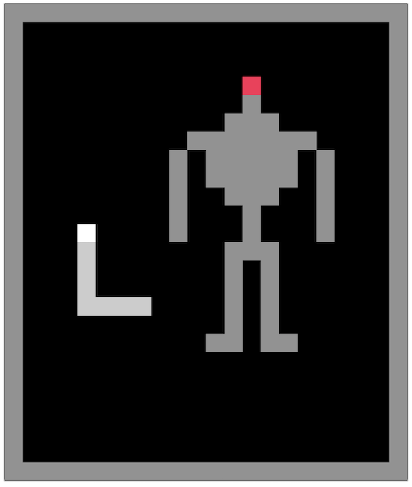

## 2017-08-13 18:23

Spent some time mocking up game screens for the candidate ten sibilant snakelikes I have it in mind to make. I'll insert the images here along with commentary on how I see the gameplay working, given that I think I've 'figured it out' in large part for these ones. Though there are naturally gaps and shitnesses to consider.

### The Witnessssss

The basic mechanic here is that it's The Witness but the snake is the line. If you had enough apples in there then you'd also create the situation where the snake can create blockages for itself too. As per the image, feel like it's a good idea to have both the 'collect all these' mechanic and something like the black/white mechanic so that you've got something a little more complex. Figure I'd only have on level rather than attempting anything so bold as generating levels or curating multiple levels. "Choose a direction to begin" would allow you to choose your entry point into the puzzle. Snake introduces a realtime element into the puzzle both in the sense of needing the skill to turn corners correctly, as well as to remember/solve the puzzle while the snake is in motion...

### Tetrisss

Tetris pieces fall as expected, snake can push them side to side (but not up? Possibly down?) with its head. They would 'land' on its body (the body is solid). Can't rotate pieces because there's actually no way for the snake to achieve that, and that lack of a require mechanic is kind of funny/part of the comedy of this remediation? Snake dies on collision with walls, pieces that have landed below... conceivably dies on upward contact? And contact with a piece pressed all the way to one side etc.

### Sssensssible Sssoccer

Two snakes, the apple is now a ball to be pushed through the appropriate opening (occurs to me now that the snakes should have different colours so that the 'teams' make sense). Idea is to dribble the ball past your opponent without dying and push the ball through. Scoring a goal would either make you longer or your opponent longer? Whichever one seems best in terms of an advantage? Would most likely go with making this a two player game to avoid needing to make an AI which would almost certainly be a piece of shit and hell to implement. This one seems like it has mild potential to be an actually interesting game... defending is partly about creating a blockage so the dribble snake kills itself - the Tron lightcycles thing. It might be too hard? If so... so be it.

### Ssshadow of the Colossssssusss

The colossus is right there, and is really big. Head contact with any part of the colossus means death (as well as walls of course). Some part of the body is an 'apple' though, which represents a handhold from the game. You have to get into position to eat the apple, which triggers the next handhold to eat, etc., till you eventually unlock the 'head' which, when you eat it, defeats the colossus. The colossus should probably move around, but maybe not at the same speed as the snake, more like once every 10 ticks or something, because otherwise I think lining things up might be pretty impossible. Some kind of sound cue would help in terms of feeling the rhythm and whether you can take a bite successfully or not. Each apple eat makes you longer. The colossus can't overlap your body.

### Sssteven'sss Sssausssage Roll

Recreate a puzzle from the game (one of the simplest ones probably? Maybe not, but certainly a space bounded one). You can push and roll the sausages as you might expect. No skewering of course, but plenty of puzzles don't rely on that. Have to grill both sausages and then locate yourself in the finishing point. Death on wall or sausage against wall or on grilling your own head. Can't push a sausage through your own body. Guess the snake never gets longer.

### Papersss Pleassse

This is one of my two 'just a gag' levels (along with Sssuper Mario Brosss.) in that all that happens is we play the intro music with its rhythmic cadence, and the snake moves in tune with that, but otherwise it is entirely Snake. Will see when the time comes whether there is some more complex idea about representing the process of the game itself (e.g. different reject/accept apples or something), but suspect that the game is simply too complex? Could have apples earn money and have interstitial scenes about being able to feed your family etc.?

### SSSSSS

Recreating the gravitron level from VVVVVV. Between two 'bouncy' lines (they would randomly reflect you sideways when you hit them, or conceivably even make you do a U-turn?). Shapes fly through and if they hit your head you die. If they hit your body they bounce off-screen. What happens if they bounce and then hit themselves? Possibly more bouncing, could be interesting to see happen. You have to survive for 60 seconds with different waves if I can be bothered. Probably not that bad actually... just need to be able to map patterns to fire onto the board. Wrap around the horizontal edges.

### Sssuper Mario Brosss.

Recreate World 1-1 from Super Mario Bros. in the 'style of' Snake. Thinking it would be nice to have colours match the game though so that it's clearer what's happening. Music possibly, but possibly also not. Or maybe it would be funny if it played at the cadence of movement, at least the melody. Basically you can't do anything because there's gravity and it's side-on. So you just move left to right, eat the Goomba tile, and then hit the side of the first pipe and die. Ha ha.

### Minesssweeper

It's literally mine sweeper with eating a tile being equivalent to clearing it in the game. It would need to react like the real Minesweeper in terms of it autoclearing things - I guess that can't be that hard? Can it? I assume it assigns a number to all squares and clears zeros? I don't know how it works. Anyway the comedy is again the real-time-ness I guess. And just fun to reimagine a grid based game in this way. I guess the easiest approach would be to have a set grid, but the more legit thing would be to generate levels properly as that would at least attempt to see if it's possible to play Minecraft in this way. I guess if the snake didn't get longer you'd have some change at holding patterns if you luckily cleared some of the board, and could then try moving intelligently from there? Suspect it would be a hard game though.

### Missssssile Command

Cities at the bottom, missiles coming down from the top. Snake in the middle. You can block missiles with your body, destroying them. If you hit a missile with your head you eat it and get longer, which is presumed to be an advantage. Have to survive a wave of N missiles to get the next level. Gets harder/more missiles. Seems like another game that has an intriguing change to it - that idea of protecting someone else with your body is quite nice, as is eating ordinance?

## 2017-08-12 16:04

How many games do I actually need for it to count? I'm thinking 10 is enough unless they turn out to be really hard to make. Current list is

- √ Tetrisss
- √ Sssensssible Sssoccer
- √ Ssshadow of the Colossssssusss
- √ Sssteven'sss Sssausssage Roll
- √ Papersss, Pleassse
- Sssuper Hexagon
- √ SSSSSS
- √ The Witnessssss
- √ Sssuper Mario Brosss.
- √ Minesssweeper
- √ Missssssile Command (ha ha)
- Asssteroidsss
- Msss. Pacman
- Ssspace War!
- Chessssss

Which is 15 so it's hopefully plausible to find 10 in there?

(Later, √ = think this can work and have designed a screen for it)

### 'Nice shot to the body'

One thing that comes up a lot when thinking about these versions is what to do when something actively hits the snake somewhere _other_ than its head. It's clear that being hit in the head kills the snake, but in the traditional game it's not possible for any other part of its body to get hit. Obvious possibilities are

- Nothing - the thing just passes through as if the snake's body isn't there (pretty dissatisfying given the solidity of the head, but videogame rules can be pretty arbitrary, and in a sense this is the 'closest' answer in terms of maintaining the same mechanics?)
- Kills the snake - any contact with any part of the snake's body means death. This is also pretty consistent with the snake 'world' and seems fair in some ways, but would pretty blatantly make most of the games stupidly hard if not impossible and therefore kind of uninteresting... there needs to be at least some possibility of play to make these remediations make sense (even if there's potentially one or more comedy style things)
- Cuts the snake - I've done this in other snakes I think? The snake can be severed and the part with the head carries on, the body remaining as a hazard. It still feels kind of physically consistent, and can lead to additional complications to the space of the game - though note that those might or might not actually be interesting?
- Bounces off - to the extent that a think hitting the snake's body necessarily is moving of its own accord, it could rebound. This would make some obvious amount of sense in something like soccer for example, and is a kind of satisfying answer - could even end up being strategic?

One question on top of all this is whether or not the 'hit in the body' should be consistent across all games? Note that even the head-hit = death concept wouldn't make sense in something like soccer, where you'd presumably be dribbling the ball with the snake's head instead?

### Graphics

I think I wrote somewhere else that it seems kind of necessary to maintain the traditional grid-based graphics of snake. I think it's okay to have lower resolution flourishes on a tile (e.g. the crosses I've used on walls in the past) but I think it's important to maintain a low-fi abstract kind of approach. But note how this will be pretty challenging to representation in some of them. Not clear, for instance, how you would show something like Steven's Sausage Roll in this context? And yet that particular game seems like it has so much potential? You need to be able to indicate rotation, which is a pretty subtle graphical effect to achieve in low resolution?

### Design

Seems like we're at the point, as I've already noted before, of needing some basic screen designs to figure this out. Occurs to me that this could be done quite well in something like Pixen with a pixel-per-tile as a form of representation, at least to think about it mechanically? Rather than notebooking, which is good too, but less rigorous in terms of the ways the layouts would actually play out... layout playouts. ha ha.

### What even is this?

I keep promising to actually write some thoughts about what I think this game is about, in response to Jonathan pointing out after reading the _It is as if you were doing work_ documentation that there's a lack of reflection on the intended meaning. I guess that's hugely because it feels 'obvious' at some internal level when I'm making a game as I gradually settle things both by thinking and by making design decisions, but it's worth trying to write a 'what this is' now and again to maintain some story of what I think I'm doing, most of all to be able to track how that changes and how that's reflected in design...

So let me actually write some initial words about what I see this game as being 'for'...

okay.

So this is clearly another game about remediation between games. I've done this before with the Breakout Indies bungle, remediating particular indie games into Breakout (Desert Golf, How Do You Do It?, etc.). I guess the core thing that this process allows you to do is to think specifically about what individual mechanics/rules mean outside their kind of base-level 'physical' meaning... I guess this is also true of visuals, too. So I guess the bigger idea is thinking about games at a lower resolution? Not so much about the overall system and its narrative etc., but about breaking a game down in order to fit it on top of another (generally simpler) game. This is part of why its important that the game you're remediating too is a simple one I guess? So Snake and Breakout are both games with minimal numbers of rules...

Snake is
- The snake moves in one direction each tick
- You can change the direction with the arrow keys
- The snake's body follows its head
- The snake gets longer if you eat an apple (and you get points - so this is the 'ultimate good thing' in the game)
- The snake dies if it hits itself or a wall (which means that a 'sub good thing' is the successful navigation of space such that you don't run into your own body)

And Snake is also a specific visual representation: a gridded world in which we have
- Snake's head
- Snake's body
- Empty space
- Apple
- Wall

As we can see, both these things are 'low resolution' in multiple ways. The game itself is low resolution in the sense of pixels (especially if you think of the game board as being one pixel per tile - and you could argue this in the sense that a tile has one specific meaning perhaps). The small selection of distinct tiles is another form of resolution - there are a very limited number of meanings available for any slot on the board in terms of visuals. And finally it's a low resolution game in terms of its rule-set... I've listed five above, three concern movement directly, two the reaction of the snake's body to contact with non-empty tiles.

Returning to remediation, this low resolution of the 'target game' makes way, it seems to me, for thinking in depth about the potential for meaning in mechanics (and visuals) and how those things come about. If we take a 'source game' and try to map it to the target game rules we're immediately forced to ask questions about how to represent source game ideas/semantics/visuals in this new (lower resolution) situation, and that low resolution requires that we get to the _heart_ of the meanings, because we just don't have so much bandwidth for representing subtlety.

One response to this would be the obvious answer that you just _can't_ do this and say that you're remediating - i.e. you lose so much information about the original game that the new thing doesn't resemble it in any useful way.

But I think the more helpful response to this is that the _difference_ between source and the resulting game are what's interesting about going through the process. The process itself is interesting because that's all about how you make and justify design and aesthetic decisions as you go. And then the nature of the final game is also interesting because it's a totality and you can make the comparison and ask what this new version tells you about the original game (and the target game system too). And because of the low resolution you can drill all the way down to code/mechanics/individual design decisions to back up any arguments you feel you can make.

Add on to that that by forcing/remediating source games onto target systems you end up with weird hybrids that might be interesting/strange/worthwhile games in their own right.

There's also the question of how much you allow yourself to stretch the target system during remediation. For instance if we think about soccer, it doesn't make sense (to me) that if the snake hits the soccer ball it either eats it or it dies... neither of those responses make for an interesting reimagining of soccer via Snake. It's true that choosing one of those two responses would maintain the _closest link_ to the target system, but it's not clear that that's the most interesting decision to make. Instead I would imagine, for instance, that the snake's head _pushes_ the ball in the direction of movement. This is true to the system of Snake in the sense that it's still a primitive physical simulation, maintains its connection to the idea of movement in space etc., but also allows for a connection back to the source system of soccer, which is all about moving a ball through space.

That discussion above is the kind of argument you should be able to make for every design decision in the process. And the fact that there is a source system and a target system and a resulting design throws these things into relief in a way that completely novel game design can't easily do. And _that_ is why this is a worthwhile and 'important' project to undertake - it has a structure that specifically puts you in a position to inspect design decisions.

(Note that you should be able to make such arguments not only for _changes_ made to the target system, but also to decisions to apply target system rules to source system meanings - for example you might decide that in Ssshadow of the Colossssssusss colliding with any part of the Colossus' body other than a 'hand hold' means that the snake dies. That's not what happens in the source game, where you just get injured, but 'injury' isn't really a concept that makes sense in Snake and to add it in would start to feel like you're pushing too far away from the strictness and resolution of the target system I'd think? But this is a discussion you'd have to have... I don't think I can fully and convincingly justify that decision right at this instant, but it's important to eventually be able to.)

So that's my opening salvo on what a game like this is about. It's almost a genre or a form of formal exercise that gives you material to exmaine design at a fine grain and _that's_ what's valuable. And note, finally(???), that this is also true for the interested player - assuming they know the source and target systems (which is encouraged by choosing well known games for these), then in examining the resulting game, they 'should' be able to have similar/related thought processes?

That's what I think for now.

## 2017-08-03 16:22

I have ten now that seem somewhat doable?

- Tetrisss
- Sssensssible Sssoccer
- Ssshadow of the Colossssssusss
- Sssteven'sss Sssausssage Roll
- Papersss, Pleassse
- Sssuper Hexagon
- SSSSSS
- The Witnessssss
- Sssuper Mario Brosss.
- Minesssweeper

BUT, I would suggest to you that SSR, Hexagon, and soccer could all be extremely difficult or just not very successful. Hexagon in particular doesn't seem like a very good idea. So it's probably important to have three in reserve if at all possible. And then to take all the game more toward some paper designing.

- Missssssile Command (ha ha)
- Asssteroidsss
- Msss. Pacman
- Ssspace War!
(Does this lean to heavy on the classic arcade side? Does that tell us something in itself?)

ALSO in the spirit of Jonathan pointing out that in _It is as if you were doing work_ I didn't actually write very much about the actual question, in that case, of speculative play and thinking about evoking thoughts about a near future etc... in the spirit of that, I should probably write at least a little something about the (nascent?) question that this game might be about or might approach?

... I will write this in a bit...

Okay bu... in a bit.

- Chessssss

## Gimme some more (2017-07-20 14:11 & 2017-07-21 10:08 & 2017-08-03 16:15)

- Tetrisss

I guess the snake moves around at the bottom and needs to eat the falling Tetris pieces? And you ... lose when the snake dies? Which would be inevitable? Or maybe the snake has to be used to push and rotate pieces (how would you rotate as opposed to just push?) maybe it can ONLY push. Hehe. That's kind of funny.... could be complex, but it could be amazing.

- Sssensssible Sssoccer

Maybe a two player game. Two goals. A ball. Have to push the ball through the goal. If you score you get longer (or maybe opponent does - not sure which would be 'balanced'). Could be fun.

- Ssshadow of the Colossssssusss

There's a big figure on the screen, if you hit it in the wrong place you die. There's a spot you have to eat (the apple) that damages it and then another appears. Har har har. Hee hee. (What happens when it hits your body? I dunno.)

(At this point I guess I want there to be 10 levels ideally? 5 as a bare, bare minimum.)

- Sssteven's Sssausssage Roll

Remediate one of the puzzles (or make one up), the snake pushes the sausages and they roll around. They collide with your body. You have to grill them and get to the end point. Sausages should probably be quite big? (Graphically this doesn't seem like it will work well... if I'm sticking with Snake style graphics then the blockiness will work against anything with detail...)

- Papersss, Pleassse

I don't know how to do this but it feels like it might be too funny? I guess one funny option would be to steal the music and have the snake move like the titles - kind of a lurching through the game. And then ... I'm not quite sure how to (or whether to) add other elements of the game... maybe it's actually just enough... maybe it's about how many of the apples you get? Maybe the purity of the music is a better gag...

- Sssuper Hexagon

I guess shapes fly in from the sides and you try to avoid them? Like a maze moving inwards the whole time to the center? Might be impossible though - you couldn't move sideways? Unless they were far enough apart?

- SSSSSS

(The letter S sssix timesss. HAHAHAHAHA.)

Could be the gravitron? You can move around (bounce off the walls?) an a stream of things come through at you. Plus apples that you can eat. I think it would have to matter whether they hit your body? Or it cuts off your body but then those pieces remain and you collide with them? (May be visually confusing?)

## More furtherer thoughts (2017-07-19 10:27)

Last time I wrote-thought about this game I told myself I should start trying to come up with some of the ways the games could actually work to start getting an understanding of how to actually work with these ideas and to hopefully find the 'identity' of the game through that process. So I guess I will obey past-me's instructions and actually try it out?

SOOOOOOO...

- The Witnessssss

This one seems like one of the easier one's to do a 'proper' remediation just because the core mechanic of The Witness is set on a grid with a snake-like movement through space. Almost too easy (and conceivably a bit boring for that reason?). Essentially this one would be a standard-issue Witness puzzle that you would solve with the Snake. It changes the puzzle because then it's in real-time (I guess this would be even more intense if you generated the puzzles, but that sounds like a total nightmare?). You can crash the snake in the normal way, but also the snake would crash at the end if you haven't solved the puzzle correctly (I guess it would just smash into the final block rather than slithering it's way out). The Witness even has things you effectively 'eat' and those could be used to make the snake longer. So it's basically highly constrained Snake.

- Sssuper Mario Brosss.

Seems roughly okay. Side-scroller with the snake on the ground (like a snake). I guess it could eat the Goomba that it runs into first, get longer, be unable to jump for any of the powerups, and then smash into a pipe and die. Ha ha hardeeharhar. I guess one interesting-ish question is how to represent this all graphically? Because it suddenly occurs to me it might be quite appealing to see this all remediated into the gridded system of normal Snake rather than trying to match the graphics of the source game? Makes my job a lot easier. BUTTTTTT... is this even interesting? SHIT. SHIT. Is it?

- Minesssweeper

You on the Minesweeper grid, starting somewhere (shouldn't have a bomb!) and you 'clear' the squares you eat (and you get longer with each one, so the levels might be insoluble?). If you eat a bomb you obviously die. And when you clear a square the board should react in the way that Minesweeper traditionally does. Basically makes the game harder (similarly to The Witness), except much, much harder because there's no real time to react to the information available and the game has random resets so you wouldn't be able to learn how it works... (is this the thematic, though? Just - oh I turned these games into Snake and now they're all bullshit and impossible? IS THAT EVEN INTERESTING? It's still kind of an interesting formal exercse?)

## Further thoughts (2017-07-14 13:46)

I'm in Hawaii and this game isn't exactly on my mind, but I did do a couple of drawings in the notebook to think about what the screens might look like. (See screenshots or whatever.) While I was drawing those I ended up feeling like I was quite unclear on what the core of the game was, and was getting confused between some different possibilities which would really mean different things about how the game should look and feel...

- The real _bungle_ idea would be that the games are kind of terrible 'versions' of the games they reference. In that case they would need to be bad. They would need to be, I guess, kind of cursory treatments of the origin game using the medium of snake... so kind of lame by design.
- Another idea would be an actually serious attempt to _remediate_ the games into Snake - actually try to figure out how the basic Snake mechanisms could be used to actually try to recreate the spirit or appearance or something of those origin games. But an actual attempt to say it's "the same game" in some sense.
- Finally, I could try to _reimagine_ the games with Snake. So rather than trying to use Snake to represent them in a kind of rigid way, reimagine Snake around the ideas from the origin game.

These all have their recommendations. Obviously I won't call it a bungle if it's not the bungled approach. It's okay to make a game called Sibilant Snakelikes without the bungle concept. That would create, I guess, a more general idea of remediation based games (in one way or another they're all oriented toward remediation).

The Bungle approach would in theory be the easiest because it would be bad on purpose.

I'm not totally clear on whether it's funny? The Breakout Indies bungle was weird because those games were kind of serious attempts to remediate the games? Well, within the specific mechanics of breakout. They weren't really 'bungled' in the sense of being badly done, they were bungles in terms of... what? I mean I guess just the bungle of making a game on the wrong 'platform' or something.

hm hm hm hm.

Anyway, anyway, anyway, hm, anyway, hm, anyway, hm.

It's fine. It'll be fine. We're fine, we're doing fine.

I guess I should just come up with a bunch of actual mechanical ideas for the snakelikes (rather than just the hilarious sibilant names) and then see what the overall situation feels like. Feel it out through the actual design.

## Early days (2017-07-09 12:02)

Was talking to Rilla about this project again at breakfast at Hof Kelsten and it occurs to me I should really write some words down about it and start the repo etc. so that I have a record of it from the early days - notably if this is going to be useful from the perspective of our larger Research Creation project.

The genesis of the idea in this case was... hmm, I'm forgetting the precise details. It was definitely about bouncing ideas back and forth with Rilla. The title "Sibilant Step Siblings" came out of us joking around. And then in the mix was this idea of reimagining various games by adding 's'es to their titles and using that as a reason it would be made as a Snake-like version of it.

So the brief here is, as you might imagine: remediating existing games into Snake. Much as Indie Bungle 2 reimagined indie games as Breakout.

There's something to be said (and perhaps seriously written) about this idea of __remediation within a medium__? Or rather the idea that the fact this seems/feels like remediation suggests almost the idea of individual __games as mediums__? It would be worth re-engaging with the remediation book/literature and perhaps making this case through research creation? Anyway that's a thread to follow moving forward.

So along with that I have the twin issues of

- A title for this thing
- A set of games to remediate

As such here are some attempts at those things...

### Games to snakify

(Looking at this it seems like adding a triple 's' for a single is a decent rule to follow - I'd imagined that doubles would do it, but they don't quite look essy enough.)

- The Witnessssss
- Fesss (a cheat on a 'z', but funny to pronounce)
- The Sssimsss
- Sssuper Mario Bros.
- Minesssweeper
- Dear Esssther
- Gran Turisssmo
- Tetrisss
- Dark Sssoulsss
- The Ssstanley Parable / The Beginner'sss Guide < That is pretty funny with the possessive, there are probably other games with a possessive of course
- Ssspace Quessst
- Candy Crush Sssaga
- Shadow of the Colossssssusss
- The Lassst of Usss
- Sssensssible Sssoccer
- ...

### Naming

- Sibilant Step Siblings < The original, but I worry it's a bit too silly for a game that is ostensibly taking itself a bit seriously...
- Snakeses
- Bungle 3: Sss
- Snakelikes < This is a contender...
- Bungle 3: Snakelikes
- Snakelikes (An XXXX Bungle)
- Sssnakelikesss

The 'bungle' aspect of this is proving difficult to like.

- Snakelike Bungle
- The Sibilant Snakelike Bungle < Getting better?
- Sibilant Snakelikes Bungle

Hmmm. Okay well maybe The Sibilant Snakelike Bungle is pretty good? It's a shame Bungle doesn't start with an S. Pretty hard to make it do that though, ultimately. I .... okay there was some distraction there while I figured out that this computer's x key is not always responsive if I hit it in the lower left quadrant. Something I'll keep an eye on. Apparently it's a pretty seriously common problem with these computers (with this butterfly mechanism). Replacements are being done. Feeling annoyed about Apple and their expensive shit right now. Expensive. With an xx. It typed that double x just then on its own. This is not a nice thing to be running into. Think about how often I type x when I'm programming. Hm. Well it's not fixable prior to going to Hawaii so I guess I'll have this slightly below par x until then.

The Sibilant Snakelikes Bungle.

How's that?

x?
x?
xX?
xx?
x?
X?
x?
x?
x?
x?
x?
x?
xX?

Hmm.
