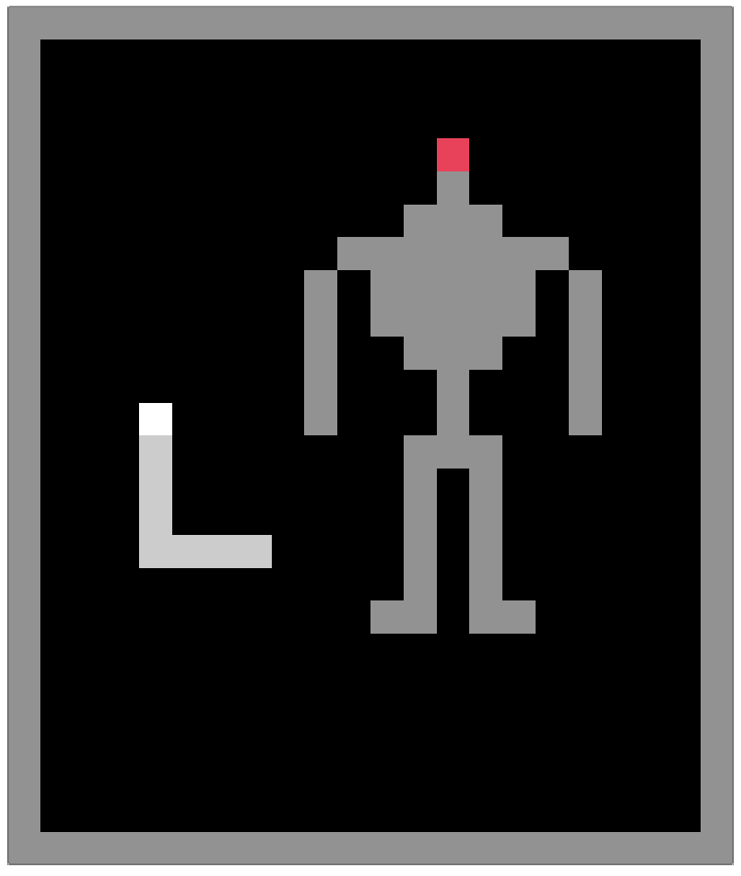
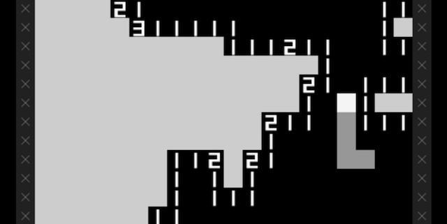

# Blog Posts

Here are posts I wrote for my public-facing blog about the game.

## New Project: Sibilant Snakelikes (2017-10-11)

Today I finally started writing some actual code for the new project I've been quietly thinking about on and off for the last several months: _Sibilant Snakelikes_. It's another iteration in my interest in how we can remediate one kind of game into another kind of game's framework. So in this case _Sibilant Snakelikes_ will be a series of remediations of existing games into the form of Snake. As per usual I'm choosing a kind of "low resolution" game as the target platform because I think that it's more controllable that way, the design decisions can achieve more clarity, the code itself is going to be less nightmarish, and also because it's quite funny to work on this kind of thing.

I've already done a bunch of designing of the subgames of the project to a point where I feel like I understand them about as well as I can in order to begin implementation (and thus begin to understand them from an implementation perspective which will naturally change elements of their design). The rule for picking games to remediate is premised on the title of the game: they have to have an 'S' in the title, which the remediated version with triple to make it more snake-y. Thus we have: Ssshadow of the Colossssssusss (pictured above), The Witnessssss, Sssuper Mario Brosss., and ssso forth. It's nice to have simple rules to make those sorts of decisions - closes down the potential design space so you don't freeze up. In a way reminds me of the kinds of constraints used by [Oulipo](https://en.wikipedia.org/wiki/Oulipo).

Each game will thus be an attempt to represent the gameplay and experience of the source game in the target system of Snake. Naturally this leads to plenty of absurdity and bizarre compromises. One thing I'm interested in is the tension between the source and target systems in terms of which has 'primacy' when deciding how to make a specific design decision. This project should be a chance to meditate on those kinds of questions as I go.

Since I started working with git to manage my production of games, and in particular since I started writing public-facing (post-release) design documentation, I've noticed I write a lot less about what I'm working on here on the website. With this project I'd quite like to remedy that. So I'll probably try to write posts here on the website, and then also just paste them into my documentation in the repository as I go - seems a reasonable compromise, and I miss attempting to communicate about this work more directly with the outside world. And, at least until I go fully open source and just develop these games in the open in a public repository (which I may well do), it'd be nice to have a 'live' portrayal of the work for anyone who's interested.

Finally, I just wanted to note here what a big deal it felt like today to finally just sit down and implement the very beginnings of Ssshadow of the Colossssssusss. In some ways it seems a bit lame to me, but I have felt kind of emotional about it. I haven't managed to work on a game since _It is as if you were doing work_, which is now about four months back. There have been perfectly good reasons (traveling to Hawaii to help run a workshop, home-life stuff that needed attention, preparation for teaching a new course, writing grant applications, writing essays for publication, going to a lot of meetings because I'm faculty at a university, etc.), but I discovering (or, really, rediscovering) just how fundamental to my sense of self working on games is. I was getting into some pretty bad emotional states because of it, to be honest with you. So there was a real sense of elation today when I actually did something toward getting a game made. Naturally now it seems like I could have just jumped in earlier and been happier, but who knows whether that's really true. Good things take time etc.

## Developing in 'Public' (2017-11-01)

Part of working on _Sibilant Snakelikes_ is that I'm working on it out of a _public_ GitHub repository this time around. You can find that repository here if you want in on the magic: https://github.com/pippinbarr/sibilant-snakelikes. Even looking at the repo now I can see it's kind of user-unfriendly in terms of actually explaining itself as a work-in-progress in terms of the non-existent README information. I should correct that.

Anyway, the repository is in public, so anyone can mosey in and see what I'm working on. A big part of the reason for that is that I'm working with colleagues (Rilla and Jonathan) on a larger project around how to more rigorously/carefully document the game concepting/design/development process for later recovery and analysis and the like. We've focused on the idea of using Git as a means to do that, and the process has its jumping-off point to some extent in the kind of work I did on games like _[SNAKISMS](https://github.com/pippinbarr/SNAKISMS/)_ and _[It is as if you were doing work](https://github.com/pippinbarr/itisasifyouweredoingwork/)_ which have quite intensive documentation as part of the repositories.

But I guess the repository being in public is kind of meaningless to the extent I don't tell anyone I'm doing it in public, so now I suppose I'm telling _you_ about it. If you wanted to, therefore, you could get the agonising, blow-by-blow experience of me working on a new game, figuring out what it means, writing a design journal, writing code, writing bad code, more bad code, then some code that works, musing on design decisions in the commit messages of my code, and on and on. It is, for better or worse, _very_ detailed. For example here is a recent commit message:

__Added nicer implementation of generating tile, had realisation about the "apple" tile from last commit__

_Just reworked the code for generating tiles to be a bit cleaner._

_? Just as I was about to change the neutral tile sprite to "apple" I realised that it doesn't make sense for them all to resemble an apple because that would mean that bombs were hidden "under" apples, which isn't fair and doesn't make sense. Minesweeper doesn't imply that the tiles are safe or not (they're just neutral). If you put them down as apples you're implying they're "good to eat". This then resolves my design issue around the snake getting longer: there are no apples so the snake will never get longer. The remediation here is that we have a traditional Minesweeper board with a Snake doing the selection of tiles rather than a mouse. It's possible obviously that this will make it impossible to play, but whose fault is that? Surely not mine._

That's what this process looks like moment to moment. Because it's me, there's a lot of philosophical worrying with the concepts the game is using. It feels like it's operating on three levels in fact: the moment-to-moment implementation of features, the meaning of those feature in the context of "translation" or "remediation" as the core value of the project, and then the methodological concerns being explored through the project as well.

So I don't know, I'm just saying this is what I'm doing. I wouldn't classify it as "performative" at this stage, because I'm kind doing a "code and write a design journal like nobody's watching" affair, rather than solliciting a more publicly interactive style. But maybe in a project down the line it would be worth pursuing the possible experience of developing more along a highly public/performative structure? I. don't. know.

Follow the repo if you want. If you don't, it's okay, I'm not watching.

## Sibilant Snakelikes Process: Language Games (2017-11-09)

_(This post is an experiment in posting the occasional process entry from my development of Sibilant Snakelikes. The text here is going to be quite unpolished because it's literally me writing an essay for myself about the current moment in the design and development, in this case of Papersss, Pleassse. The actual commit of this journal is [here](https://github.com/pippinbarr/sibilant-snakelikes/commit/f502a2e06defe65ba35a2671366a0ee6224592e4))_

This morning I added the barest basics of this version, in keeping with the design thinking I wrote about yesterday. So there's an immigrating snake crossing from left to right across the screen through two holes in the walls. It's targeting an apple that represents, I guess, the "good life" in the other country, which is funny. Need to decide whether that's something to actively include.

One mini-concern: the holes in the walls mean that the player snake could _leave_ which I don't want. But perhaps they just die instantly if they try to leave the office prematurely? Or could that be one "ending" of the game - that you run away. Maybe we hear a gunshot after you go off the screen? That might be kind of amazing actually. This would also do something for the idea of making the actual inner environment smaller, too - it would make sense to have a little bit of outer-space.

One of the big challenges up-coming is the information about who to let through or not for the day. (Which reminds me that obviously I now need a representation of time. I guess just "DAY 1" or whatever and then a time of day.) I'd already decided it was based on color, speed, length. So I need to be able to generate instructions based on those _and_ have them display nicely in my extremely limited grid of letter tiles available. Note that this will be even worse if the inner area is smaller - unless I display the instructions at the bottom of the screen, below the lower bound of the walls?

Also need the "payment screen" where you eat the apples you've earned over the course of the day. Which is funny. But of course yields a more complicated set of states, so I'll need some state tracking as well for that.

But if we try to imagine some texts as rules... well we should look at what the source game says actually. Duh. Duh duh duh. "Must have a passport", "Arstotzkan citizens only", "All documents must be current", "Foreigners require an entry ticket", "Workers must have a work pass", "No weapons or contraband", "No entry from Impor", ...

Importantly we can see there are both positive and negative rules. "Must have X", "Must not have Y". So we can imagine rules like

- NO BLUE SNAKES
- MUST BE MINIMUM 5 UNITS LONG
- NO SNAKES LONGER THAN 3 UNITS
- ONLY RED SNAKES
- SLOW SNAKES NOT ADMITTED
- NO FAST SNAKES

As I type these it becomes apparent that it's unclear how to discuss the "speed" of a snake in language - how does the player know what constitutes a fast or a slow snake? I guess it's just relative to their own speed of movement which is constant. That seems pretty fair.

And of course one could combine these rules as well - I think it would be easier to just stack them (one line each if at all possible?) rather than construct sentences out of them. Then we could have representations of the rules, generate the rule text, and check each snake against the current rules.

Then the question would be how to generate the snakes trying to get in. If the rule is ONLY BLUE SNAKES then do I try to conspicuously have more blue snakes, or just leave that aspect to complete randomness? (I know that in Papers, Please it's a designed sequence at certain points to create narrative events, but other than that I _think_ it's just random? I could easily be wrong about that. Also, I could check but I can't be bothered right now.) Basically I think random is fine and is in the basic spirit of the thing. You have to see a snake and judge it and act. All in a potentially very small amount of time.

And there are interactions between rules and snake-body that might be problematic. Say it's "only fast snakes" so you block a slow snake, but then a fast snake comes... it'll be much more likely to hit your body that's still there from blocking the slow one? Maybe not. And of course you could end up out of position relative to a fast snake especially since you can't catch up with it. But these are just "things" that I might put down to "realism". Ha ha. Realism.

Although it would be easier to only write rules in one way, like "NO BLUE SNAKES", "NO BLUE OR RED SNAKES", "NO BLUE, RED, OR GREEN SNAKES" and so on, that won't be as "fun" as being able to also say "ONLY BLUE SNAKES" for example? If I only have three snake colours (in terms of labelling) it might not be so hard to randomly flip those to OK/NOT OK and then generate an appropriate text - e.g. if two are on and one off it's "NO" for the off one. If one is on it's "ONLY" for the on one. If all on then I guess we don't have a rule on color. Seems fine.

Should there be a difficulty progression? There is one in Papers, Please. I guess it would be straightforward to only generate a single rule for the first day, two for the second, and then three thereafter. And then it may become apparent how to complicate these things further?

Complications can also be done via the representation of the snakes as well. A "blue snake" could be various shades of blue which would be pretty fun (I'd want to be able to use tint() for that?). Like "is that snake blue? Or green?" if it's some ambiguous shade. That's fun. Likewise you could imagine a snake that comes in slow, then speeds up! Or a snake that comes in at three units, but then partway through pops out another unit. That's pretty funny. Ha ha ha ha. I'm laughing over here.

FYI the available area of text (outside the walls) is 22 characters.

- NO RED SNAKES (13)
- ONLY GREEN SNAKES (17)
- NO FAST SNAKES (14)
- ONLY SLOW SNAKES (16)
- NO LONG SNAKES (14)
- ONLY SHORT SNAKES (17)
- NO SNAKES LONGER THAN 5 UNITS (29) < e.g. can't have something this complex if I'm shooting for single line
- ONLY 3-5 UNIT SNAKES (20) < this would fit but seems unclear
- NO 5 UNIT SNAKES < fits, seems clearer?
- ONLY 7 UNIT SNAKES < okay... but is "unit" appropriate? < maybe short/long is better? Although that will conflict with any idea of you getting longer when you eat your money at the end? Hmmmmmmmmm.

I think it may be better to have 3/5/7 unit snakes and have either one NO or one ONLY for those lengths? It's not quite as fun in terms of variable lengths though. I guess you could ask for 3+ unit snakes. ONLY 3 OR LESS UNIT SNAKES (26)

- NO LONGER THAN 6 BITS (21)
- NO SHORTER THAN 4 BITS (22)

Does 'bits' work as a term? It's something I use under the hood occasionally. Okay look this something I can solve later. Shut up Pippin.

OH MY GOD YOU COULD HAVE RENEGADE SNAKES ZOOMING PAST OUTSIDE THE OFFICE!!!
